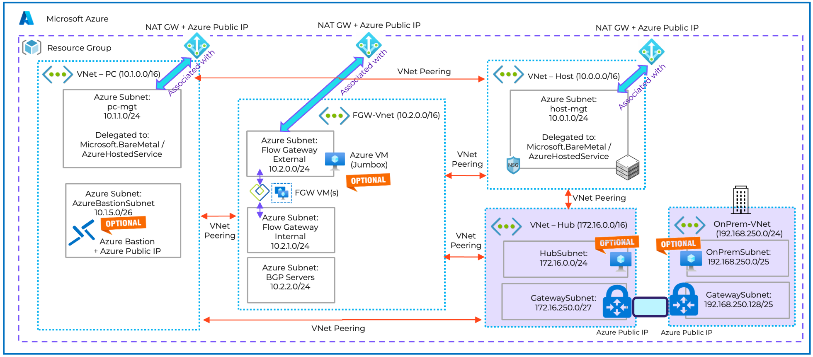

## Nutanix Cloud Cluster (NC2) on Azure - Simple Landing Zone for POC

## Scenario interconnexion with a Site to Site VPN on a Hub and Spoke topology (NO Azure Virtual WAN)

This repo contains Terraform files to deploy all Azure network components needed to deploy Nutanix Cloud Cluster(NC2) on Azure Baremetal.

This is for the scenario with an interconnexion with a VPN site to Site (Azure Gateway) and [Hub and Spoke topology without vWAN](https://learn.microsoft.com/en-us/azure/architecture/networking/architecture/hub-spoke?tabs=cli)

 This branch include a Hub VNet, a VNet to simulate an On Prem network, a Site to Site VPN between on premises and Hub.

 


## Prerequisites

- All prerequisites for NC2 : https://portal.nutanix.com/page/documents/details?targetId=Nutanix-Cloud-Clusters-Azure:nc2-clusters-azure-getting-ready-for-deployment-c.html
- For AOS < 6.7 (on AOS 6.7 or higher, Flow Gateways are deployed in a dedicated Flow Gateway VNet)


- An Azure Subscription with enough privileges (create RG, AKS...)
- Azure CLI 2.57 or >: <https://docs.microsoft.com/en-us/cli/azure/install-azure-cli?view=azure-cli-latest>
   And you need to activate features that are still in preview and add extension aks-preview to azure CLI (az extension add --name aks-preview)
- Terraform CLI 1.5 or > : <https://www.terraform.io/downloads.html>

You can also clone this repo in your [Azure Cloud Shell](https://shell.azure.com/) (that has all tools installed)

## Step by step operations

Edit [configuration.tfvars](configuration.tfvars) to define your Azure resources names, your networks CIDR...

 
 

If you want to connect to Prism Element or Prism Central through Internet, there is an option to enable an Azure Bastion instance and a Windows Server 2022 Virtual Machine Jumbox. You can also deploy as an option a virtual machine in the Hub Virtual Network and another in the "on premise" Virtual Network.


1. Terraform Init phase  

```bash
terraform init
```

2. Terraform Plan phase

```bash
terraform plan --var-file=configuration.tfvars
```

3. Terraform deployment phase (add TF_LOG=info at the beginning of the following command line if you want to see what's happen during deployment)

```bash
terraform apply --var-file=configuration.tfvars
```


4. Wait until the end of deployment (It should around an hour because of Azure VPN Gateway that meed around 1 hour to deploy)

Important :exclamation: : If the deployment finishes with an error on peering, just re execute the previous command (step 3) !

:warning: You have to delete VMs used for testing network connectivity BEFORE starting the NC2 cluster deployment through NC2 Portal. If you don't do that you will have issue during the deployment of Flow Gateway.

5. Go to Nutanix [NC2 Portal](https://cloud.nutanix.com) https://cloud.nutanix.com and start your Nutanix Cluster deployment wizard. In steps 4 (Network), 5 (Prism Central) and 6 (Flow Networking) select the Virtuals Networks and Subnets created in step 3 using terraform

 

 

 

6. After the Landing Zone deployment is successfull, you can test connectivity with on-premises or other Azure VNet using "on prem"VM and "on Hub VM". If you enabled AzureBastion and Jumpbox VM, you can login to the Jumbox VM and connect Prism Element or Prism Central through a web browser. 

Notes : 
 - you don't need Azure Bastion or Jumbox 24/7. You can simply enable or disable these resources in [configuration.tfvars](configuration.tfvars) file (EnableJumboxVM and EnableAzureBastion | 0= disabled , 1=enabled)
 - you don't need "On prem" Virtual Machine 24/7. You can simply enable or disable these resources in [configuration.tfvars](configuration.tfvars) file (EnableVM4testingNetwork_OnPremises | 0= disabled , 1=enabled) 
 - you don't need "On Hub" Virtual Machine 24/7. You can simply enable or disable these resources in [configuration.tfvars](configuration.tfvars) file (EnableVM4testingNetwork_HubVnet | 0= disabled , 1=enabled) 

7. Use the solution and configure Nutanix features like VPC, categories...
   - Create and configure your Nutanix VPC
   - Deploy User VM on Nutanix Cluster
   - Test connectivity of UVM. (cf. https://portal.nutanix.com/page/documents/details?targetId=Nutanix-Cloud-Clusters-Azure:nc2-clusters-azure-network-connectivity-uvm-c.html)

8. When you want to destroy the Nutanix Cloud Cluster, use the NC2 Portal (https://cloud.nutanix.com) to terminate it.

9. After cluster terminaison, you can destroy the landing zone using the following command : 
```bash
terraform destroy --var-file=configuration.tfvars
```

## How much does it cost to test this landing zone ?

It's cheap to test and customize this simple landing zone. Of course if you don't  need some resources (like VM or Bastion) except for testing, you should disabled them.

You can use **infracost** (available on https://www.infracost.io/) to check the estimate price for 1 month.

```bash
infracost breakdown --path .
```

 Here is an example for Azure Germany West Central region

 :exclamation: Important : this landing zone cost estimation does not include the cost of Azure Baremetal instance(s) used as node(s) in the Nutanix Cluster because Baremetal pricing is not yet available through Azure Pricing API.

 

 Please have a look of metal instances prices here : https://azuremarketplace.microsoft.com/en-us/marketplace/apps/nutanixinc.nc2_azure?tab=overview. Pricing is per instance-hour consumed for each instance, from the time an instance is launched until it is terminated or stopped. 

 
