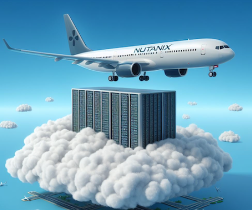
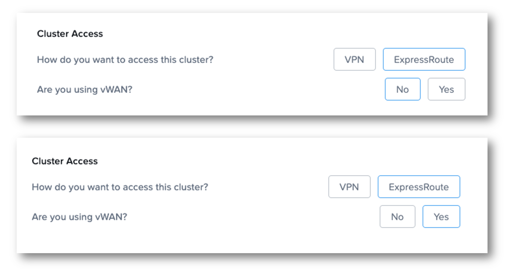
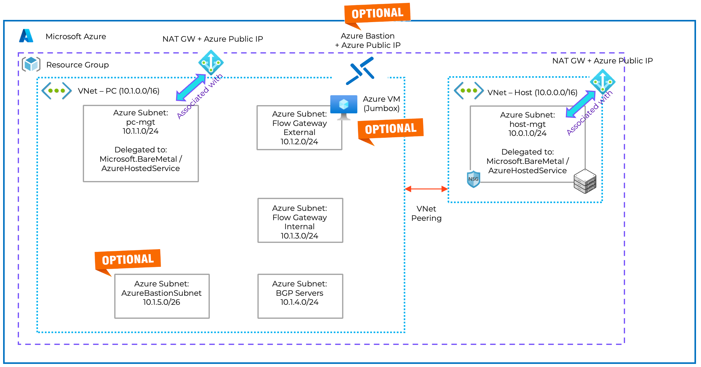

## Nutanix Cloud Cluster (NC2) on Azure - Simple Landing Zone for POC

## Scenario interconnection with an Azure ExpressRoute on a Hub and Spoke topology (with or without Azure Virtual WAN)

This repo contains Terraform files to deploy all Azure network components needed to deploy Nutanix Cloud Cluster(NC2) on Azure Baremetal.

 

:warning: :warning: :warning: This code applies for the following scenarios :
- You access this cluster through an **Azure ExpressRoute** connection and a [Hub and Spoke Topology](https://learn.microsoft.com/en-us/azure/architecture/networking/architecture/hub-spoke?tabs=cli)
- You access this cluster through an **Azure ExpressRoute** connection and [Hub and Spoke Topology with Azure vWAN](https://learn.microsoft.com/en-us/azure/architecture/networking/architecture/hub-spoke-vwan-architecture)

 

If you are using VPN Site to Site (Azure VPN Gateway) to hybrid with your on-premises Nutanix Cluster(s), please use the [vpn-novWAN branch of this repo](https://github.com/squasta/Simple-Landing-Zone-for-NC2-on-Azure/tree/vpn-novWAN).


## Prerequisites

- All prerequisites for NC2 : https://portal.nutanix.com/page/documents/details?targetId=Nutanix-Cloud-Clusters-Azure:nc2-clusters-azure-getting-ready-for-deployment-c.html
- For AOS < 6.7 (on AOS 6.7 or higher, Flow Gateways are deployed in a dedicated Flow Gateway VNet)


- An Azure Subscription with enough privileges (create RG, AKS...)
- Azure CLI 2.57 or >: <https://docs.microsoft.com/en-us/cli/azure/install-azure-cli?view=azure-cli-latest>
   And you need to activate features that are still in preview and add extension aks-preview to azure CLI (az extension add --name aks-preview)
- Terraform CLI 1.5 or > : <https://www.terraform.io/downloads.html>

You can also clone this repo in your [Azure Cloud Shell](https://shell.azure.com) (that has all tools installed)

## Step by step operations

Edit [configuration.tfvars](configuration.tfvars) to define your Azure resources names.

If you want to define your own IP ranges, edit [landing-zone-nc2.tf](landing-zone-nc2.tf)  (I will change that later to put everything as a variable)
 

1. Terraform Init phase  

```bash
terraform init
```

2. Terraform Plan phase

```bash
terraform plan --var-file=configuration.tfvars
```

3. Terraform deployment phase (add TF_LOG=info at the beginning of the following command line if you want to see what's happen during deployment)

```bash
terraform apply --var-file=configuration.tfvars
```

4. Wait until the end of deployment (It should take less than 1 minute)

 

If you want to connect to Prism Element or Prism Central through Internet, there is an option to enable an Azure Bastion instance and a Windows Server 2022 Virtual Machine Jumbox

 

5. Go to Nutanix [NC2 Portal](https://cloud.nutanix.com) https://cloud.nutanix.com and start your Nutanix Cluster deployment wizard. In steps 4 (Network), 5 (Prism Central) and 6 (Flow Networking) select the Virtuals Networks and Subnets created in step 3 using terraform

 

 

 

6. After the deployment is successfull, you can add connectivity with on-premises or other Azure VNet or services by peering an Hub Vnet or Virtual vWAN vHub. If you enabled AzureBastion and Jumpbox VM, you can login to the Jumbox VM and connect Prism Element or Prism Central through a web browser.

7. Use the solution and configure Nutanix features like [Flow VPC](https://squasta.github.io/configurationvpcazure.html), categories...

8. When you want to destroy the Nutanix Cluster, use the NC2 Portal (https://cloud.nutanix.com) to terminate it.

9. After cluster terminaison, you can destroy the landing zone using the following command : 
```bash
terraform destroy --var-file=configuration.tfvars
```

## How much does it cost to test this landing zone ?

It's very cheap to test and customize this simple landing zone.

You can use **infracost** (available on https://www.infracost.io/) to check the estimate price for 1 month. Here is an exemple for Azure Germany West Central region

 :exclamation: Important : this landing zone cost estimation does not include the cost of Azure Baremetal instance(s) used as node(s) in the Nutanix Cluster. 

 

 Please have a look of metal instances prices here : https://azuremarketplace.microsoft.com/en-us/marketplace/apps/nutanixinc.nc2_azure?tab=overview. Pricing is per instance-hour consumed for each instance, from the time an instance is launched until it is terminated or stopped. 

 Note : you don't need Azure Bastion or Jumbox 24/7. You can simply enable or disable these resources in configuration.tfvars file (0= disabled , 1=enabled) 